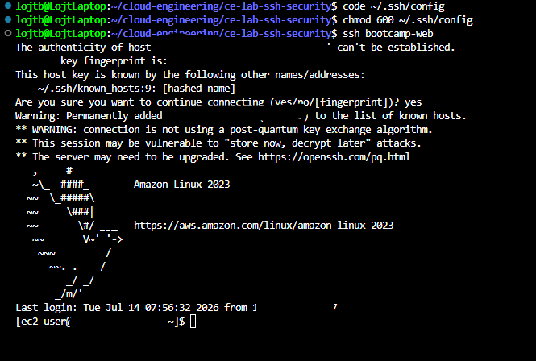
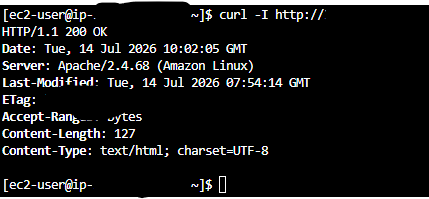
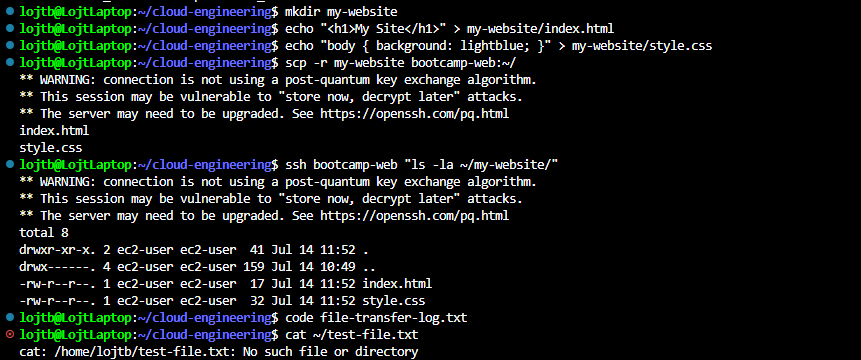

# SSH Connection and Security Best Practices Lab - Solution

**Student Name:** [Your Name]  
**Date Completed:** [Date]

---

## Instance Details

- **Instance ID:** [i-xxxxxxxxxxxxx]
- **Public IP:** [x.x.x.x — redact if repo is public]
- **Security Group:** [week2-web-server-sg]
- **Key Pair:** [bootcamp-week2-key.pem]

---

## Step 1: Create SSH Config File



**My `~/.ssh/config`:**
```
[Paste your host entry here]
```

- [ ] Connected using the alias: `ssh bootcamp-web`

---

## Step 2: Test Security Group Restrictions



| Test | Expected | Result |
|------|----------|--------|
| `ssh bootcamp-web` | ✅ Connects | [ ] |
| `curl -I http://YOUR_PUBLIC_IP` | ✅ HTTP 200 | [ ] |
| `ping YOUR_PUBLIC_IP` | ❌ Timeout | [ ] |
| `nc -zv YOUR_PUBLIC_IP 3306` | ❌ Blocked | [ ] |

**Why did ping and port 3306 fail?**

[Your answer]

---

## Step 3: Modify Security Group Rules


- [ ] Added HTTPS rule (port 443, source 0.0.0.0/0)
- [ ] Tested it — what happened? [Your answer]
- [ ] Removed the HTTPS rule again

---

## Step 4: Configure SSH Connection Timeouts

**What these settings do:**

- `ServerAliveInterval 60` — [Your answer]
- `ServerAliveCountMax 3` — [Your answer]
- `TCPKeepAlive yes` — [Your answer]
- `Compression yes` — [Your answer]

**Idle for 2 minutes — did the connection stay alive?** [Yes / No]

---

## Step 5: Practice SCP (Secure Copy)



- [ ] Copied a file TO the instance
- [ ] Copied a file FROM the instance
- [ ] Copied a whole directory

**Commands I used:**
```bash
[Paste your scp commands here]
```

---

## Step 6: Harden SSH Configuration (On Instance)


**Output of `sudo sshd -T | grep -i "passwordauthentication\|permitrootlogin\|pubkeyauthentication"`:**
```
[Paste output here]
```

| Setting | Expected | Actual |
|---------|----------|--------|
| PasswordAuthentication | no | [ ] |
| PermitRootLogin | without-password | [ ] |
| PubkeyAuthentication | yes | [ ] |

> Only verify these settings — do not modify `sshd_config`.

---

## Step 7: Create Connection Aliases with Scripts

**My `connect-bootcamp.sh`:**
```bash
[Paste your script here]
```

- [ ] Made it executable and tested it

---

## Step 8: Security Group Audit


**Inbound rules:**

| Port | Source | Purpose |
|------|--------|---------|
| [22] | [YOUR_IP/32] | [SSH access] |
| [80] | [0.0.0.0/0] | [Web traffic] |

**Is this configuration secure? What would you improve?**

[Your answer]

---

## Step 9: Troubleshooting

**Problems I ran into and how I fixed them:**

[List them here, or write "None encountered"]

---

## Step 10: Security Best Practices

**Which advanced practices did you try or read about (custom SSH port, MFA, session logging)?**

[Your answer]

---

## Bonus Challenges (Optional)

- [ ] **Challenge 1:** Restrict outbound traffic — what broke? [Your answer]
- [ ] **Challenge 2:** Multiple security groups — how do they combine? [Your answer]
- [ ] **Challenge 3:** Connection multiplexing — was it faster? [Your answer]
- [ ] **Challenge 4:** Port forwarding with `ssh -L` — what is it useful for? [Your answer]

---

## Reflection Questions

### 1. Why use an SSH config file instead of typing the full command every time?

[Your answer]

### 2. Why restrict SSH to your IP instead of 0.0.0.0/0?

[Your answer]

### 3. What did the blocked ping and port 3306 tests teach you about security groups?

[Your answer]

### 4. Why disable password authentication for SSH?

[Your answer]

---

## Key Learnings

**What was most challenging about this lab?**

[Your reflection]

**What security practice will you always follow from now on?**

[Your reflection]

---

## Checklist

- [ ] SSH config file working with alias
- [ ] Security group tests done and documented
- [ ] Security group rule added and removed
- [ ] SCP tested both directions
- [ ] SSH daemon settings verified
- [ ] Connection script created
- [ ] Security group audited
- [ ] All screenshots captured
- [ ] Reflection questions answered
- [ ] Work committed to Git
- [ ] Pull request created

---

**Completed By:** [Your Name]  
**Date:** [Date]
